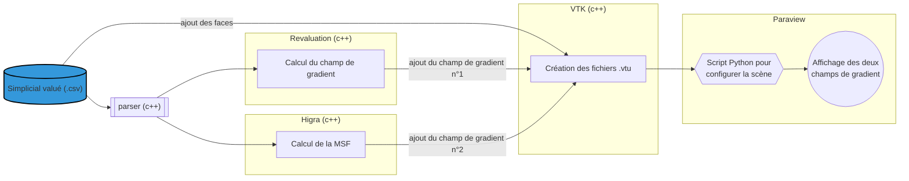

```mermaid
graph LR

    S[("Simplicial valué (.csv)")]:::data
    S --> PAR
    S -- "ajout des faces" --> VTU
    
    PAR[["parser (c++)"]]
    PAR --> R
    PAR --> M
    
    subgraph "Revaluation (c++)"
        R[Calcul du champ de gradient]   
    end
    R -- "ajout du champ de gradient n°1" --> VTU
    
    subgraph "Higra (c++)"
        M["Calcul de la MSF"]
    end
    M -- "ajout du champ de gradient n°2" --> VTU
    
    subgraph "VTK (c++)"
        VTU["Création des fichiers .vtu"]
    end
    VTU --> SC
    
    subgraph "Paraview"
        SC{{"Script Python pour <br /> configurer la scène"}}
        VIS(("Affichage des deux <br /> champs de gradient"))
        SC --> VIS
    end
    
    classDef data fill:#3498DB,stroke:BLACK,stroke-width:2px 

```
